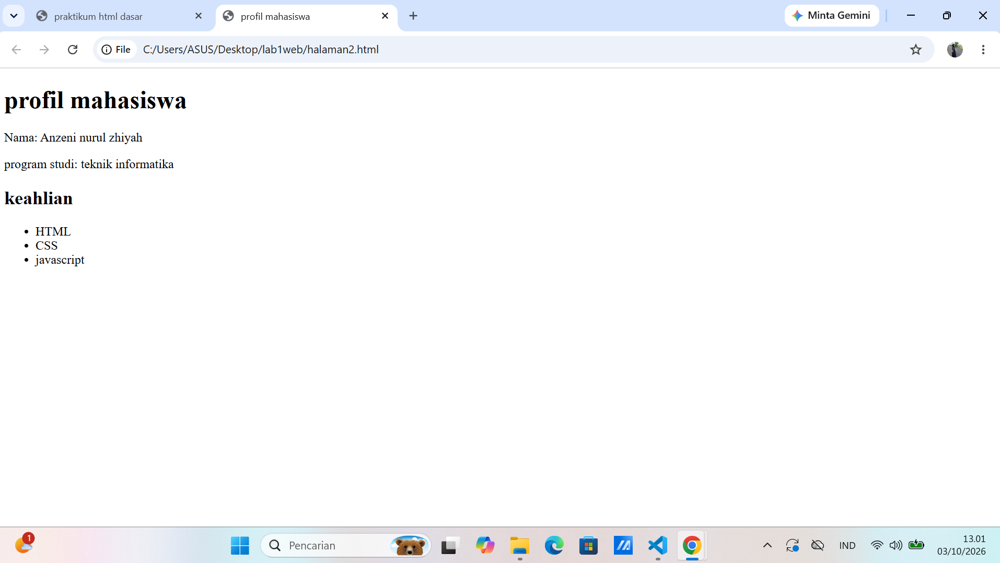

# Praktikum 1: HTML Dasar

## Nama
Anzeni Nurul Zhiyah

## Program Studi
Teknik Informatika

## 1. Tujuan Praktikum

Praktikum ini bertujuan untuk memahami struktur dasar HTML,
tag-tag dasar HTML, atribut, heading, paragraf, hyperlink,
gambar, dan list.

---

## 2. Membuat Struktur Dasar HTML

Pada tahap pertama dibuat file `index.html` dengan struktur dasar
dokumen HTML yang terdiri dari `<!DOCTYPE html>`, `<html>`,
`<head>`, `<title>`, dan `<body>`.

**Screenshot:**


---

## 3. Membuat Paragraf dan Heading

Pada tahap ini dibuat paragraf menggunakan tag `<p>` dan judul
menggunakan tag `<h1>` dan `<h2>`.

**Screenshot:**

 
](<02- paragraf.png>)

---

## 4. Memformat Teks

Pada tahap ini dilakukan pemformatan teks menggunakan beberapa
tag HTML seperti `<b>`, `<i>`, `<mark>`, `<sub>`, dan `<sup>`.

**Screenshot:**


](<03- format teks.png>)

---

## 5. Menambahkan Gambar

Pada tahap ini ditambahkan gambar ke dalam halaman HTML menggunakan
tag `` dan atribut `src`, `width`, `alt`, serta `title`.

**Screenshot:**


](<04- menambahkan gambar .png>)

---

## 6. Menambahkan Hyperlink

Pada tahap ini dibuat hyperlink untuk berpindah ke halaman lain
dan menuju website eksternal.

Hyperlink yang digunakan:
- Dasar HTML
- Halaman 2
- Website Eksternal

**Screenshot:**


---

## 7. Membuat List

Pada tahap ini dibuat unordered list dan ordered list.

Unordered list digunakan untuk menampilkan daftar keahlian,
sedangkan ordered list digunakan untuk menampilkan urutan belajar.

**Screenshot:**



---

## 8. Menambahkan Komentar HTML

Pada tahap ini ditambahkan komentar HTML menggunakan
`<!-- komentar -->` sebagai penanda pada bagian kode.

Komentar tidak ditampilkan pada halaman browser.

**Screenshot:**


---

## 9. Menggabungkan Semua Elemen

Pada tahap ini seluruh elemen HTML yang telah dipelajari
digabungkan menjadi halaman Profil Mahasiswa.

Halaman tersebut berisi navigasi, foto, data diri, keahlian,
dan target belajar.

**Screenshot:**


](<07- komentar-1.png>)

---

## 10. Jawaban Pertanyaan

### 1. Apa fungsi deklarasi `<!DOCTYPE html>`?

Untuk memberitahu browser bahwa dokumen menggunakan HTML5.

### 2. Apa perbedaan tag, elemen, dan atribut?

Tag adalah penanda HTML, elemen merupakan bagian HTML yang terdiri
dari tag dan isi, sedangkan atribut merupakan informasi tambahan
pada sebuah tag.

### 3. Apa perbedaan `<p>` dengan `<br>`?

`<p>` digunakan untuk membuat paragraf, sedangkan `<br>` digunakan
untuk berpindah baris.

### 4. Apa fungsi atribut `href`?

Untuk menentukan alamat atau tujuan hyperlink.

### 5. Apa perbedaan hyperlink internal dan eksternal?

Hyperlink internal mengarah ke halaman dalam website yang sama,
sedangkan hyperlink eksternal mengarah ke website lain.

### 6. Apa fungsi `src` dan `alt` pada ``?

`src` digunakan untuk menentukan lokasi gambar, sedangkan `alt`
digunakan untuk memberikan teks alternatif atau deskripsi gambar.

### 7. Apa perbedaan `<ul>` dan `<ol>`?

`<ul>` digunakan untuk membuat daftar tanpa nomor, sedangkan
`<ol>` digunakan untuk membuat daftar berurutan.

### 8. Apa yang terjadi jika path gambar pada `src` salah?

Gambar tidak dapat ditampilkan pada browser.

### 9. Mengapa heading h1 sampai h6 digunakan secara terstruktur?

Agar judul dan subjudul pada halaman web tersusun dengan jelas
sesuai tingkatannya.

### 10. Apa fungsi komentar HTML?

Komentar digunakan untuk memberikan catatan atau penanda pada kode
dan tidak ditampilkan oleh browser.

---

## 11. Struktur File

Struktur file praktikum yang dibuat adalah:

```text
Lab1Web/
├── index.html
├── halaman2.html
├── images/
│   └── profil.jpg.jpeg
└── README.md